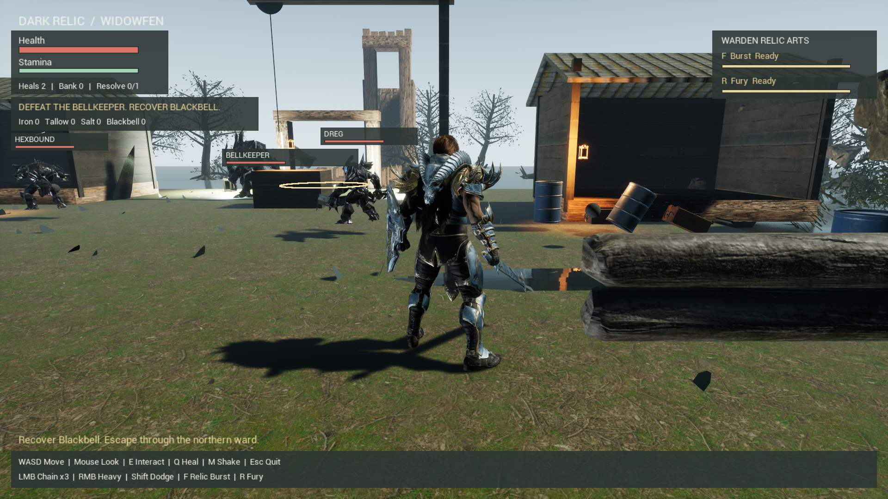

# DARK RELIC

**Enter Widowfen. Recover Blackbell. Survive the way out.**



*Actual packaged gameplay capture from the realistic Widowfen candidate, September 13, 2026.*

[Hackyard entry](#hackyard-yard-2--backlog) · [Game & world](#game--world) · [How to play](#how-to-play) · [Install & run](#install--run) · [Build status](#build-status)

## Hackyard Yard #2 — Backlog

**One human builder: [Marlandoj](https://github.com/marlandoj). One compact dark-fantasy extraction game, developed with AI assistance.** Dark Relic turns a larger game idea from the backlog into a playable encounter: enter Widowfen, fight for Blackbell, and survive the ward's extraction countdown.

Prepared for [Hackyard Yard #2](https://hackyard.tech/yards/yard-2), September 11–13, 2026. The build window runs from **September 11 at 11:00 AM Arizona to September 13 at 11:00 AM Arizona** (18:00 UTC on each date). This repository is submission material; an accepted Hackyard entry is not yet recorded.

| Start here | What is available |
| --- | --- |
| Gameplay | Sword combos, heavy strikes, dodge, healing, Relic Burst, fading Fury aura, three enemy roles, boss area attack and enrage, loot and timed extraction. |
| Screenshot | The gameplay splash above shows the packaged Widowfen environment and the current HUD. |
| Latest source | Gameplay, reviewer polish and the realistic Widowfen scene; [environment and verification details](REALISTIC-WIDOWFEN.md). |
| Playable build | Verified locally on Windows. A public download and hosted gameplay video are not yet available. **Download ZIP gives source, not the game.** |
| Review without Unreal | Run `bash scripts/test-core.sh`: 169 portable gameplay/presentation checks and a command-line extraction example. |
| Submission fields | [Short writeup, model disclosure, timing and remaining checklist](SUBMISSION.md). |

**AI and asset disclosure:** development used OpenAI GPT-6 Astra through Codex on Zo Computer, with AI game-specialist advice and Moonshot-model source reviews. Asset preparation used fal.ai and Tripo. Unreal Engine, Paragon characters/animations/voices and premade environment assets are dependencies, not original art made for the event. No model/API key is needed to play the packaged game.

**Build timing:** the earliest recorded source-kit commit is September 11 at **1:49 PM Arizona**, inside the event window. Planning, visual preparation and asset acquisition began earlier; commit timestamps do not prove when every input was created. See [timing and provenance](SUBMISSION.md#timing-and-provenance) for the disclosure boundaries.

## Game & world

Dark Relic is a **solo, third-person PvE extraction game** built in Unreal Engine for Windows. You play the Warden, an armored fighter entering the ruined settlement of Widowfen to recover the Blackbell Relic. Fight its defenders, gather supplies, and survive a timed extraction to keep what you carried out. Death costs your current haul; previously banked rewards survive.

The hackathon edition concentrates on one compact encounter: one weapon, light and heavy attacks, a dodge, limited healing, two common enemy roles, one elite, four loot types, and one permanent upgrade. It targets **8–12 minute runs**; that is a design target, not a measured completion time. Combat rewards spacing, watching enemy windups, and saving stamina to evade.

This build is single-player. Optional co-op belongs to the broader concept and is not implemented in the demo. Multiplayer servers, blockchain, procedural worlds, multiple weapons, and deep crafting are outside the hackathon scope.

### Widowfen

Widowfen is the demo's only playable location: a dark-fantasy ruin of weathered timber, rough ground, abandoned structures, and stark pools of light. The visual direction is ominous and worn, with readable silhouettes and combat warnings.

Three landmarks define the encounter: the ruined settlement where the defenders engage you, Blackbell's guarded pickup, and the **northern ward**, the extraction zone. These are parts of one compact level, not separate regions of an open world.

### The Warden and the defenders

| Character | Role in the demo |
| --- | --- |
| **Warden** | Your playable fighter, represented by Paragon Greystone with bound idle, movement, attack, evasion, and death animations. |
| **Dreg** | A close-range common enemy. Make room, watch its windup, and strike between attacks. |
| **Hexbound** | A common enemy that threatens you from farther away. Distance and line of sight matter. |
| **Bellkeeper** | The elite guarding Blackbell. Defeat it to unlock the relic pickup. |

The three enemy roles use distinct Paragon Minions character bindings. These are the prototype's gameplay identities, not a claim of authorship of the marketplace character models.

## How to play

1. **Enter the encounter.** Move with WASD and look with the mouse. Check health, stamina, and remaining heals in the HUD.
2. **Fight deliberately.** Face your target for light or heavy attacks. Watch the enemy's `! DODGE` warning and let stamina recover between actions. Healing has a windup and limited charges.
3. **Gather spoils.** Move close to a pickup and press **E**. Iron, Tallow, and Salt add value to a successful run.
4. **Defeat the Bellkeeper and collect Blackbell.** The elite locks the relic while alive. **You must carry Blackbell to start extraction** in the current encounter; ordinary loot alone is insufficient.
5. **Reach the northern ward.** Press **E** inside the extraction zone and survive the countdown. Leaving the zone cancels extraction; re-enter and press E to restart it. Enemies can still damage or kill you during the countdown.
6. **Bank, upgrade, repeat.** Escape banks your carried loot. Death discards it while preserving your bank. At the result screen, press **U** to buy Resolve if affordable, then **R** for another run.

### Controls

| Input | Action |
| --- | --- |
| **W / A / S / D** | Move |
| **Mouse** | Look / control the camera |
| **Left mouse button** | Light attack; three timed strikes end in Sunder |
| **Right mouse button** | Heavy attack |
| **Left Shift** | Dodge / evasive hop |
| **Q** | Heal |
| **F** | Relic Burst: nearby magic shockwave, 8-second cooldown |
| **E** | Collect a nearby pickup or start extraction inside the ward |
| **U** | Buy Resolve at the end of a run |
| **R** | Warden Fury during play; restart after extraction or death |
| **Escape** | Quit the game |
| **M** | Toggle camera shake in the enhancement candidate |

The current evasion uses Greystone's jump-start animation: an evasive hop, not a custom dodge roll. Keyboard and mouse are the documented controls.

### Warden abilities and hit reactions

The latest **Polish Candidate** includes every enhancement described here. Minions recoil and grunt when hit; Bellkeeper has smaller recoil and deeper vocals. See [enemy reaction details and validation](ENEMY-FEEDBACK.md).

Fury adds an expressive power-up gesture, crimson-and-gold rim glow, rising embers and local lighting. The glow fades with the remaining Fury power. See [transformation behavior and validation](WARDEN-AURA.md).

Warden reacts to landed enemy hits with a short knockback and has Greystone vocal reactions for strikes, dodges, relic powers, Fury, healing and pain. See [hit and voice feedback](WARDEN-FEEDBACK.md).

Chain three light strikes for **Sunder**, unleash a **Relic Burst** with F, or activate **Warden Fury** with R for six seconds of stronger attacks and reduced incoming damage. Cooldowns and stamina limit both relic arts. Warden combines sword combat with relic magic; Q healing and result-screen R restart are preserved. See [ability details and validation](WARDEN-ABILITIES.md). Older Windows packages retain their original moves; use the latest candidate for the complete feature set.

### Final-day enhancement candidate

The demo includes softer Widowfen lighting, warm path lanterns, landed-hit sparks and sound, optional camera shake, procedural swamp ambience and footsteps, and escalating extraction bells and ward effects. The Bellkeeper marks a 360 cm area before striking; leave the ring or time your dodge. Below half health it becomes enraged, with faster movement and a shorter but still visible warning. The latest Windows candidate has passed compilation, packaging and automated gameplay checks. The operator accepted gameplay and audio in the preceding Enemy Feedback build; a fresh full-run acceptance of the latest polish is not recorded. See [enhancement behavior and validation boundaries](ENHANCEMENTS.md) and the [playtest checklist](PLAYTEST.md).

### Loot and progression

| Item | Bank value per pickup | Purpose |
| --- | --- | --- |
| Iron | 10 credits | Ordinary spoils |
| Tallow | 15 credits | Ordinary spoils |
| Salt | 20 credits | Ordinary spoils |
| Blackbell | 100 credits | Named relic; required for extraction in this encounter |

The default extraction countdown is **20 seconds**, and each run starts with **two healing charges**. **Resolve** costs **100 banked credits**, can be purchased once, and adds **20 maximum health on the next run**. Bank and upgrade progress use a local save; carried loot is not permanent progression. These are current defaults, subject to balancing.

## Install & run

### Play the packaged Windows demo

**A Windows package has been built and tested, but no downloadable GitHub Release is published as of September 12, 2026.** GitHub's **Code → Download ZIP** provides repository files, not the playable game.

If you have received the complete demo package:

1. Extract the **entire package** to a writable local folder, preserving its directories. Copying only the executable will not work.
2. If included, double-click **`Play Dark Relic.cmd`**, which selects the verified DirectX 11 configuration. Otherwise use the PowerShell command below in the `Windows` folder. Despite its name, `DarkRelicSmoke.exe` normally starts the playable demo.
3. Use the controls above; press Escape to quit.

The packaged demo does not require opening Unreal Editor. If Windows reports a missing runtime, use the Unreal prerequisite installer if included with the supplied package. The tested rendering path is **DirectX 11 at 1920 × 1080**. For that windowed configuration, run this from the package's `Windows` folder in PowerShell:

```powershell
.\DarkRelicSmoke.exe -dx11 -windowed -ResX=1920 -ResY=1080
```

Do not add `-DarkRelicSmoke` or `-DarkRelicCapture` for normal play: those are automated verification modes that exit on completion. Formal minimum hardware specifications have not yet been established.

### Realistic Widowfen environment

Open **Dark Relic Realistic Widowfen** on the development desktop for the new scene: alder trees, marsh plants, wet textured ground, puddles, mossy stone and a ruined belfry beyond the settlement. It preserves the existing combat and character bindings. See [scene integration and verification](REALISTIC-WIDOWFEN.md) for the prepared-project workflow and verified delivery.

### Get the gameplay source

The default **`main` branch contains the gameplay source, Unreal integration scripts, and documentation**, including Warden abilities, Fury aura, player/enemy feedback, warning and audio polish, and the realistic Widowfen environment. The environment builds on Polish gameplay revision `a36a252` without changing combat source. The older prepared Enemy Feedback ZIP does not contain the newer polish or environment changes.

```bash
git clone https://github.com/marlandoj/Dark-Relic.git
cd Dark-Relic
bash scripts/test-core.sh
```

The portable checks require **Bash and a C++17 compiler (`g++` by default)** on Linux or an appropriate WSL environment, without Unreal. The script builds tests and a command-line demo in a temporary directory and cleans it afterward. It verifies gameplay rules; it does not launch the graphical game.

### Build with Unreal Engine

This is a **source kit**, not a self-contained Unreal project. It includes the gameplay plugin and integration scripts, but no `.uproject`, cooked game package, binary maps, or third-party source assets. Cloning it alone cannot reproduce the pictured scene.

The integration was developed with **Unreal Engine 5.8.1**, a Windows C++ build toolchain, and a prepared Third Person project containing Widowfen, Blackbell, Paragon Greystone, and Paragon Minions assets.

1. Work in a disposable copy of your prepared Unreal project. Acquire required assets through their providers and preserve their licensing records.
2. Copy `Plugins/DarkRelicCore` from `main` into the project's `Plugins` directory. Back up any existing plugin first.
3. Enable **Dark Relic Core**, generate project files, and compile the host project's **Development Editor / Win64** target. A Blueprint-only host needs a native C++ target.
4. Follow [Character integration](https://github.com/marlandoj/Dark-Relic/blob/main/CHARACTER-INTEGRATION.md) for the prepared map, asset bindings, validation, and packaging. The character map is `/Game/WidowfenPrep/LVL_DarkRelicCharacters`.
5. For the latest scene, follow [reviewer polish](REVIEW-POLISH.md), then [realistic Widowfen](REALISTIC-WIDOWFEN.md). These scripts depend on the prepared enhanced map and character/voice bindings; the earlier character guide alone does not reproduce the newest package.
6. Validate the scene in the editor, then package for Windows and verify the standalone executable.

**The `integration/` scripts contain project-specific Windows paths and require already imported maps and assets. They are not blank-project installers.** Review paths, prerequisites, and existing build receipts before use. The older [Windows integration guide](https://github.com/marlandoj/Dark-Relic/blob/main/WINDOWS-INTEGRATION.md) describes the original component-wiring route; its pending-build statements predate the current character-build verification.

## Repository guide

These paths are on **`main`**:

| Path | Contents |
| --- | --- |
| `Plugins/DarkRelicCore/` | Unreal runtime plugin and Blueprint-callable run component. |
| `Plugins/DarkRelicCore/Source/DarkRelicCore/Public/Portable/DarkRelicRules.h` | Engine-independent C++17 rules for combat resources, loot, extraction, and progression. |
| `Plugins/DarkRelicCore/Source/DarkRelicCore/Private/DarkRelicEncounter.cpp` | Playable encounter, enemies, input, character playback, HUD, and runtime checks. |
| `integration/` | Prepared-project map assembly, character binding, build, capture, and package scripts. |
| `tests/`, `examples/`, `scripts/test-core.sh` | Portable checks and command-line demo. |
| `CHARACTER-INTEGRATION.md` | Current character-integration procedure and verification limits. |
| `WINDOWS-COMBAT-HANDOFF.md` | Encounter design, tuning, and acceptance scenarios. |
| `ASSET-BOUNDARY.md` | Third-party asset inventory boundary and outstanding receipt verification. |

The Unreal adapter consumes the portable rules, so core checks exercise the same rules used by the game. Scene, animation, input, and packaging behavior require separate Unreal runtime checks.

## Build status

Recorded latest-candidate evidence as of **September 13, 2026**:

- **169 portable gameplay checks** and **two geometry tests** pass for the environment candidate.
- Unreal compilation, character bindings, packaging, and rendered captures completed successfully.
- **102 editor runtime checks and 102 packaged runtime checks** passed with exit code 0, including Bellkeeper, Warden abilities, Fury, recoil, vocal priority, spatial cues and run rewards. These are automated checks, not human playthroughs.
- A separate normal-play session exited cleanly through Escape.
- Sixteen inspected packaged captures cover eight HUD states at **720p and 1080p**, with no material compilation errors or editor shader-preparation overlay. The saved scene contains 650 new decorative actors and preserves 101 baseline colliders and the character/voice bindings.
- Eighteen source files match the committed code; 57 protected release files, including the earlier submission archive, remain unchanged. The new desktop shortcut is verified.
- The environment pass uses specialist routing in shadow mode; it has no new independent specialist approval. The operator accepted gameplay and audio in the preceding Enemy Feedback build. This newer environment has not undergone a fresh human full-run or headphone/speaker/mono comparison.
- CSV profiling captured frames but returned **777003 during shutdown** with both audio enabled and disabled. The bounded investigation is parked; full performance acceptance remains pending.

The new environment package is `H:\DarkRelicRealisticPackage\Windows\DarkRelicSmoke.exe`. The earlier **Dark Relic Polish Candidate** remains at `H:\DarkRelicPolishPackage\Windows\DarkRelicSmoke.exe`. These are local Windows builds, not public binary downloads. See [environment delivery and verification](REALISTIC-WIDOWFEN.md).

The hero image demonstrates the packaged environment. It does not establish photorealistic parity with the concept artwork or benchmark performance. See [Character verification notes](CHARACTER-INTEGRATION.md).

## Credits & asset availability

The character build uses **Epic Games' Paragon Greystone and Paragon Minions**, environment/prop sources from **Poly Haven**, and a Blackbell prop produced through the project's **Tripo** workflow. Preparation also used **fal.ai** for visual concepts.

This repository publishes project source, documentation, and the rendered gameplay screenshot above. It does **not** redistribute marketplace meshes, animations, textures, the complete Unreal Content folder, or the generated source asset library. Obtain those dependencies from their providers and retain their terms and receipts.

Marketplace receipt export and final submission-license verification remain outstanding in the project records. Tripo generation and prior payment evidence are retained privately. See [asset boundary](ASSET-BOUNDARY.md), [credits](CREDITS.md), and [submission preparation](SUBMISSION.md). This README grants no license to third-party assets and does not assert that all submission rights have been cleared.
