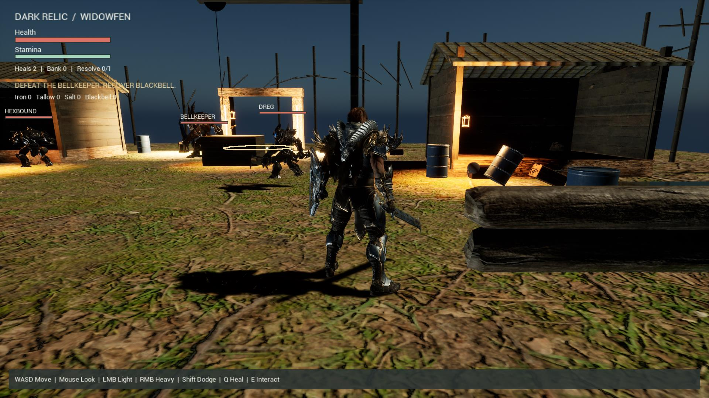

# DARK RELIC

**Enter Widowfen. Recover Blackbell. Survive the way out.**



*Actual game-view capture from the enhanced Unreal candidate, September 12, 2026.*

[Game & world](#game--world) · [How to play](#how-to-play) · [Install & run](#install--run) · [Repository guide](#repository-guide) · [Build status](#build-status)

## Game & world

Dark Relic is a **solo, third-person PvE extraction game** built in Unreal Engine for Windows. You play the Warden, an armored fighter entering the ruined settlement of Widowfen to recover the Blackbell Relic. Fight its defenders, gather supplies, and survive a timed extraction to keep what you carried out. Death costs your current haul; previously banked rewards survive.

The hackathon edition concentrates on one compact encounter: one weapon, light and heavy attacks, a dodge, limited healing, two common enemy roles, one elite, four loot types, and one permanent upgrade. It targets **8–12 minute runs**; that is a design target, not a measured completion time. Combat rewards spacing, watching enemy windups, and saving stamina to evade.

This build is single-player. Optional co-op belongs to the broader concept and is not implemented in the demo. Multiplayer servers, blockchain, procedural worlds, multiple weapons, and deep crafting are outside the hackathon scope.

### Widowfen

Widowfen is the demo's only playable location: a dark-fantasy ruin of weathered timber, rough ground, abandoned structures, and stark pools of light. The visual direction is ominous and worn, with readable silhouettes and combat warnings.

Three landmarks define the encounter: the ruined settlement where the defenders engage you, Blackbell's guarded pickup, and the **northern ward**, the extraction zone. These are parts of one compact level, not separate regions of an open world.

### The Warden and the defenders

| Character | Role in the demo |
| --- | --- |
| **Warden** | Your playable fighter, represented by Paragon Greystone with bound idle, movement, attack, evasion, and death animations. |
| **Dreg** | A close-range common enemy. Make room, watch its windup, and strike between attacks. |
| **Hexbound** | A common enemy that threatens you from farther away. Distance and line of sight matter. |
| **Bellkeeper** | The elite guarding Blackbell. Defeat it to unlock the relic pickup. |

The three enemy roles use distinct Paragon Minions character bindings. These are the prototype's gameplay identities, not a claim of authorship of the marketplace character models.

## How to play

1. **Enter the encounter.** Move with WASD and look with the mouse. Check health, stamina, and remaining heals in the HUD.
2. **Fight deliberately.** Face your target for light or heavy attacks. Watch the enemy's `! DODGE` warning and let stamina recover between actions. Healing has a windup and limited charges.
3. **Gather spoils.** Move close to a pickup and press **E**. Iron, Tallow, and Salt add value to a successful run.
4. **Defeat the Bellkeeper and collect Blackbell.** The elite locks the relic while alive. **You must carry Blackbell to start extraction** in the current encounter; ordinary loot alone is insufficient.
5. **Reach the northern ward.** Press **E** inside the extraction zone and survive the countdown. Leaving the zone cancels extraction; re-enter and press E to restart it. Enemies can still damage or kill you during the countdown.
6. **Bank, upgrade, repeat.** Escape banks your carried loot. Death discards it while preserving your bank. At the result screen, press **U** to buy Resolve if affordable, then **R** for another run.

### Controls

| Input | Action |
| --- | --- |
| **W / A / S / D** | Move |
| **Mouse** | Look / control the camera |
| **Left mouse button** | Light attack |
| **Right mouse button** | Heavy attack |
| **Left Shift** | Dodge / evasive hop |
| **Q** | Heal |
| **E** | Collect a nearby pickup or start extraction inside the ward |
| **U** | Buy Resolve at the end of a run |
| **R** | Restart after extraction or death |
| **Escape** | Quit the game |
| **M** | Toggle camera shake in the enhancement candidate |

The current evasion uses Greystone's jump-start animation: an evasive hop, not a custom dodge roll. Keyboard and mouse are the documented controls.

### Final-day enhancement candidate

This branch adds softer Widowfen lighting, warm path lanterns, landed-hit sparks and sound, optional camera shake, procedural swamp ambience and footsteps, and escalating extraction bells and ward effects. The Bellkeeper marks a 360 cm area before striking; leave the ring or time your dodge. Below half health it becomes enraged, with faster movement and a shorter but still visible warning. The separate Windows candidate has passed compilation, packaging and automated gameplay checks. Human end-to-end acceptance remains pending. See [enhancement behavior and validation boundaries](ENHANCEMENTS.md) and the [playtest checklist](PLAYTEST.md).

### Loot and progression

| Item | Bank value per pickup | Purpose |
| --- | --- | --- |
| Iron | 10 credits | Ordinary spoils |
| Tallow | 15 credits | Ordinary spoils |
| Salt | 20 credits | Ordinary spoils |
| Blackbell | 100 credits | Named relic; required for extraction in this encounter |

The default extraction countdown is **20 seconds**, and each run starts with **two healing charges**. **Resolve** costs **100 banked credits**, can be purchased once, and adds **20 maximum health on the next run**. Bank and upgrade progress use a local save; carried loot is not permanent progression. These are current defaults, subject to balancing.

## Install & run

### Play the packaged Windows demo

**A Windows package has been built and tested, but no downloadable GitHub Release is published as of September 12, 2026.** GitHub's **Code → Download ZIP** provides repository files, not the playable game.

If you have received the complete demo package:

1. Extract the **entire package** to a writable local folder, preserving its directories. Copying only the executable will not work.
2. Open its `Windows` folder and launch **`DarkRelicSmoke.exe`**. Despite its name, launching this executable normally starts the playable demo.
3. Use the controls above; press Escape to quit.

The packaged demo does not require opening Unreal Editor. If Windows reports a missing runtime, use the Unreal prerequisite installer if included with the supplied package. The tested rendering path is **DirectX 11 at 1920 × 1080**. For that windowed configuration, run this from the package's `Windows` folder in PowerShell:

```powershell
.\DarkRelicSmoke.exe -dx11 -windowed -ResX=1920 -ResY=1080
```

Do not add `-DarkRelicSmoke` or `-DarkRelicCapture` for normal play: those are automated verification modes that exit on completion. Formal minimum hardware specifications have not yet been established.

### Get the gameplay source

The default **`main` branch contains the gameplay source, Unreal integration scripts, and documentation** delivered through [PR #1](https://github.com/marlandoj/dark-relic-hackathon-kit/pull/1) and [PR #2](https://github.com/marlandoj/dark-relic-hackathon-kit/pull/2).

```bash
git clone https://github.com/marlandoj/Dark-Relic.git
cd Dark-Relic
bash scripts/test-core.sh
```

The portable checks require **Bash and a C++17 compiler (`g++` by default)** on Linux or an appropriate WSL environment, without Unreal. The script builds tests and a command-line demo in a temporary directory and cleans it afterward. It verifies gameplay rules; it does not launch the graphical game.

### Build with Unreal Engine

This is a **source kit**, not a self-contained Unreal project. It includes the gameplay plugin and integration scripts, but no `.uproject`, cooked game package, binary maps, or third-party source assets. Cloning it alone cannot reproduce the pictured scene.

The integration was developed with **Unreal Engine 5.8.1**, a Windows C++ build toolchain, and a prepared Third Person project containing Widowfen, Blackbell, Paragon Greystone, and Paragon Minions assets.

1. Work in a disposable copy of your prepared Unreal project. Acquire required assets through their providers and preserve their licensing records.
2. Copy `Plugins/DarkRelicCore` from `main` into the project's `Plugins` directory. Back up any existing plugin first.
3. Enable **Dark Relic Core**, generate project files, and compile the host project's **Development Editor / Win64** target. A Blueprint-only host needs a native C++ target.
4. Follow [Character integration](https://github.com/marlandoj/dark-relic-hackathon-kit/blob/main/CHARACTER-INTEGRATION.md) for the prepared map, asset bindings, validation, and packaging. The character map is `/Game/WidowfenPrep/LVL_DarkRelicCharacters`.
5. Validate the scene in the editor, then package for Windows and verify the standalone executable.

**The `integration/` scripts contain project-specific Windows paths and require already imported maps and assets. They are not blank-project installers.** Review paths, prerequisites, and existing build receipts before use. The older [Windows integration guide](https://github.com/marlandoj/dark-relic-hackathon-kit/blob/main/WINDOWS-INTEGRATION.md) describes the original component-wiring route; its pending-build statements predate the current character-build verification.

## Repository guide

These paths are on **`main`**:

| Path | Contents |
| --- | --- |
| `Plugins/DarkRelicCore/` | Unreal runtime plugin and Blueprint-callable run component. |
| `Plugins/DarkRelicCore/Source/DarkRelicCore/Public/Portable/DarkRelicRules.h` | Engine-independent C++17 rules for combat resources, loot, extraction, and progression. |
| `Plugins/DarkRelicCore/Source/DarkRelicCore/Private/DarkRelicEncounter.cpp` | Playable encounter, enemies, input, character playback, HUD, and runtime checks. |
| `integration/` | Prepared-project map assembly, character binding, build, capture, and package scripts. |
| `tests/`, `examples/`, `scripts/test-core.sh` | Portable checks and command-line demo. |
| `CHARACTER-INTEGRATION.md` | Current character-integration procedure and verification limits. |
| `WINDOWS-COMBAT-HANDOFF.md` | Encounter design, tuning, and acceptance scenarios. |
| `ASSET-BOUNDARY.md` | Third-party asset inventory boundary and outstanding receipt verification. |

The Unreal adapter consumes the portable rules, so core checks exercise the same rules used by the game. Scene, animation, input, and packaging behavior require separate Unreal runtime checks.

## Build status

Recorded enhancement-candidate evidence as of **September 12, 2026**:

- **105 portable gameplay checks** passed, including an AddressSanitizer/UndefinedBehaviorSanitizer run.
- Unreal compilation, character bindings, packaging, and rendered captures completed successfully.
- **33 editor runtime checks and 33 packaged runtime checks** passed with exit code 0, including the new Bellkeeper and feedback behaviors. These are automated checks, not human playthroughs.
- A separate normal-play session exited cleanly through Escape.
- CSV profiling captured frames but returned **777003 during shutdown** with both audio enabled and disabled. The bounded investigation is parked. Human play/feel review and full performance acceptance remain pending.

The hero image demonstrates the enhanced map's game view, not final art quality or benchmark performance. See [Character verification notes](CHARACTER-INTEGRATION.md).

## Credits & asset availability

The character build uses **Epic Games' Paragon Greystone and Paragon Minions**, environment/prop sources from **Poly Haven**, and a Blackbell prop produced through the project's **Tripo** workflow. Preparation also used **fal.ai** for visual concepts.

This repository publishes project source, documentation, and the rendered gameplay screenshot above. It does **not** redistribute marketplace meshes, animations, textures, the complete Unreal Content folder, or the generated source asset library. Obtain those dependencies from their providers and retain their terms and receipts.

Marketplace receipt export and final submission-license verification remain outstanding in the project records. See [Asset boundary](https://github.com/marlandoj/dark-relic-hackathon-kit/blob/main/ASSET-BOUNDARY.md). This README grants no license to third-party assets and does not assert that all submission rights have been cleared.
