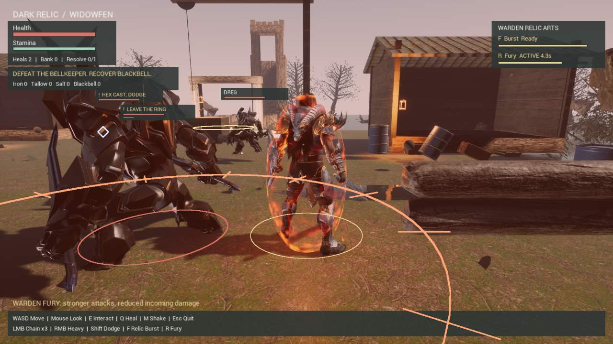

# Realistic Widowfen environment

The environment candidate adds alder trees, reeds, ferns, wet textured earth, irregular puddles, mossy stone, scattered slate, broken timber, a distant causeway and ruined belfry. Cooler lighting and layered fog give the settlement more depth. It interprets the Widowfen concept in playable 3D geometry; the concept image is not used as a flat backdrop.

The scene contains 650 new decorative actors and 224 deterministic plantings. Decoration has collision disabled. The saved map is compared against the polish baseline for character, animation and voice bindings, Fury assets, player and extraction positions, and retained collision geometry. Combat rules, abilities and input source are unchanged.

Actual rendered editor capture, September 13, 2026. This is staged verification footage from the candidate, not the concept artwork or a human playthrough.

## Build and review

This remains a prepared-project workflow, not a blank-project installer. It requires the verified Polish project with `/Game/WidowfenPrep/LVL_DarkRelicEnhanced`, the existing Poly Haven source folders and materials, and the existing Paragon character/voice bindings. No additional asset purchase or model API is required.

1. Stage the integration scripts in `H:\DarkRelicRealisticDelivery-20260913\integration`. Inspect the hardcoded project, engine and delivery paths before adapting to another machine.
2. `install_realistic_widowfen.ps1` verifies the Polish baseline and protected release hashes, copies it to a separate project, and invokes `run_realistic_build.ps1`.
3. `widowfen_geometry.py` generates five reproducible GLB meshes. `realistic_widowfen.py` assembles `/Game/WidowfenPrep/LVL_DarkRelicRealistic`; `validate_realistic_scene.py` verifies saved gameplay parity.
4. The build runs 102 Unreal gameplay checks and captures eight rendered HUD/gameplay states in DX11. Material compilation failures block visual review. Inspect the actual images before creating a passing `IntegrationEvidence/visual-review.json` receipt.
5. `package_realistic_widowfen.ps1` requires the passing build, parity and visual receipts, selects the new default map in the isolated project, packages into a separate output and reruns the 102 checks.
6. `verify_realistic_release.ps1` captures eight states at both 720p and 1080p, exercises normal Escape exit, verifies source and protected-release hashes, and creates the separate candidate shortcut. Keep desktop input idle during its ordinary-play stage.

Existing destination folders and receipts block accidental reruns. Inspect terminal receipts, logs and any surviving child process before retrying; preserve failed-attempt evidence. Do not overwrite accepted packages or their shortcuts.

## Verification status

Recovered September 13, 2026: 169 portable gameplay checks and two geometry tests pass. The Windows scene saves and reloads; 650 decorative actors, 101 retained colliders and gameplay bindings pass parity. All 102 editor runtime checks pass. Eight DX11 captures were inspected: environment additions, combat warnings, extraction prompts and result states are visible. The capture log contains no material compilation errors. The first neutral editor frame caught transient shader preparation; the packaged starting frame must be checked after cooking.

The package launch request and initial status query timed out. Its execution state is unconfirmed. Read `H:\DarkRelicRealisticDelivery-20260913\package-release-job.json` and the candidate's `realistic-package.json` / `realistic-release.json` before restarting anything. The last verified state is the completed editor candidate. Packaged delivery, ordinary Escape exit, release hashes and the new shortcut remain pending.

Run the portable checks with `bash scripts/test-core.sh` and the geometry checks with `python tests/test_widowfen_geometry.py`. These do not substitute for rendered Unreal validation. Specialist routing for this environment pass is shadow-only, not an independent review or human playthrough.
