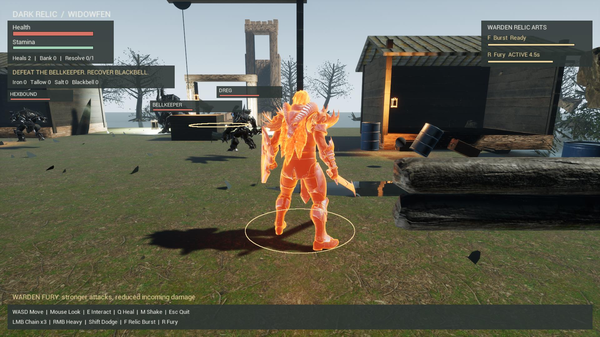

# Warden body glow

Fury now lights the Warden's animated skeletal mesh with an additive crimson-and-gold material overlay. The separate sphere and eight orbiting ember meshes are removed. The original armor materials remain in place beneath the glow. The production Fury timer controls the existing charge and fade curve; expiry, death, extraction completion, restart and encounter teardown restore the previous overlay. Local light intensity is reduced from 850 to 350.

The six-second ability, cooldown, damage bonuses, animation, voice and Realistic Widowfen scene remain unchanged.

Actual packaged gameplay at 1920 × 1080, DirectX 11.

## Integration

Use the verified `H:\DarkRelicRealistic-20260913` project as the baseline. Stage the changed plugin source and `integration` scripts beneath `H:\DarkRelicBodyGlowDelivery-20260913`. Exit the running game before starting the build.

Run `integration/run_body_glow_build.ps1` from that delivery. It copies the baseline into `H:\DarkRelicBodyGlow-20260913`, compiles the editor plugin, creates the skeletal-mesh-compatible material, binds it in the realistic map, runs gameplay checks and captures charge, peak, fade and off states. The driver preserves existing releases and refuses to reuse an existing receipt without inspection. Use `-PrepareOnly` to copy, compile and bind while an existing packaged game remains open, then `-ResumeRuntime` once it closes.

Inspect all four captures and the DX11 material log before writing a passing `visual-review.json` in the delivery directory. Then run the same driver with `-Package`. The separate output is `H:\DarkRelicBodyGlowPackage`. Review packaged captures and normal Escape exit before creating a shortcut or reporting deployment complete.

## Current verification

Delivered September 13, 2026 at **5:09 PM Arizona**, through the **Dark Relic Warden Body Glow** desktop shortcut. The executable is `H:\DarkRelicBodyGlowPackage\Windows\DarkRelicSmoke.exe`; the shortcut supplies the verified DX11 windowed configuration. Source and integration revision: `5bae6d26ec5de38f0ef06242ef4260f08ef80dd1`.

- 169 portable gameplay/presentation checks pass; binding-script syntax and Git whitespace checks pass. No TypeScript is involved.
- Windows C++ compilation, saved/reloaded material and animation bindings, and packaging pass.
- 102 editor runtime checks and 102 packaged runtime checks pass, including body-glow activation and original-overlay restoration on expiry.
- All four packaged charge, peak, fade and off captures pass visual inspection at 1080p DX11. The early editor capture contained shader preparation; the cooked charge frame renders correctly without that overlay. No material compilation failures appear in the packaged capture or runtime logs.
- Normal keyboard R activates Fury, and Escape exits with code 0. Fifteen source/integration file hashes match the committed revision; all 85 protected files from previous releases are unchanged.
- The first editor runtime attempt failed boss-contact and extraction checks. Its receipt and log are preserved. Scripted movement/look input is now isolated from desktop input; subsequent editor and packaged checks pass. Normal gameplay controls remain enabled.

Final receipt: `H:\DarkRelicBodyGlow-20260913\IntegrationEvidence\body-glow-release.json`. `integration/verify_body_glow_release.ps1` validates the reviewed frame hashes, source manifest, normal inputs and protected releases before creating and reading back the shortcut. The normal encounter's R input and tick consume the same material/timer behavior exercised by runtime checks.

Specialist routing is shadow-only; no independent specialist approval or fresh human full-run acceptance is claimed. This delivery does not establish a performance benchmark or alter earlier submission/licensing follow-ups.
